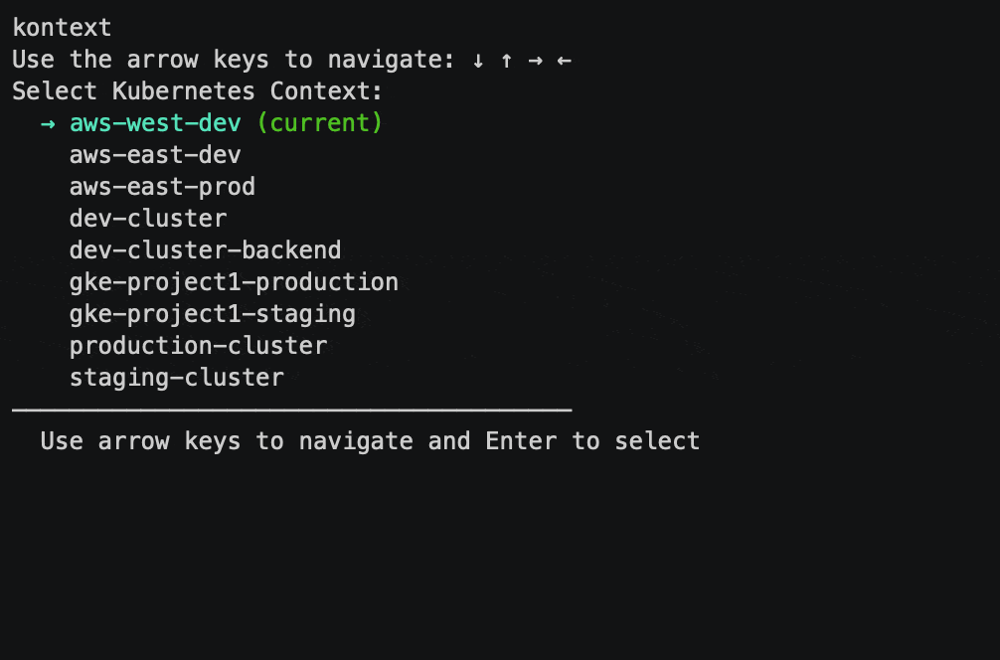

# Kontext

A simple CLI tool for managing Kubernetes contexts with ease.



## Overview

Kontext helps you manage your Kubernetes contexts efficiently with a simple command-line interface. It allows you to:

- List all available Kubernetes contexts
- Show your current active context
- Switch between contexts with tab completion
- Interactively select contexts from a menu
- View and change namespaces within contexts

## Installation

```bash
go install github.com/user-cube/kontext@latest
```

## Usage

### List all available contexts

```bash
kontext list
```

This will display all contexts from your kubeconfig with the current context highlighted.

### Show current context

```bash
kontext current
```

### Switch to a different context

```bash
kontext switch <context-name>
```
With tab completion for context names!

### Interactive context selection

Simply run:
```bash
kontext switch
```
Without any arguments to get an interactive selection menu of all available contexts.

You can also run just:
```bash
kontext
```
To access the same interactive context selection.

### Namespace Management

View or change the current namespace:
```bash
kontext namespace
```
or use the shorter alias:
```bash
kontext ns
```

Show the current namespace without the selector:
```bash
kontext ns --show
# or with short flag
kontext ns -s
```

Switch to a specific namespace without using the interactive selector:
```bash
kontext ns my-namespace
```

### Switch Context and Namespace Together

Switch context and then set namespace in one command:
```bash
# Interactive context selection, then namespace selection
kontext switch -n
# or with the root command
kontext -n

# Select specific context, then namespace selection
kontext switch my-context -n
# or with the root command
kontext my-context -n

# Select specific context and directly set namespace
kontext switch my-context -n my-namespace
# or with the root command
kontext my-context -n my-namespace
```

## Features

- **Smart Context Sorting**: Current context is prioritized in selection lists
- **Smart Namespace Sorting**: Current namespace is prioritized in selection lists
- **Non-Existent Namespace Handling**: Warns when non-existent namespaces are specified
- **Detailed Information**: Clear success/error messages with color-coded output
- **Tab Completion**: Supports bash/zsh completions for context and namespace names
- **Intuitive UI**: Interactive selectors with highlighted current selections
- **Offline Mode Support**: Fallback behavior when clusters are unavailable

## Examples

Here are some common workflows:

### Viewing Available Resources

```bash
# List all contexts
kontext list

# Show current context
kontext current

# Show current namespace
kontext ns -s
```

### Changing Contexts

```bash
# Switch to a context interactively
kontext switch
# or simply
kontext

# Switch to specific context
kontext switch my-dev-cluster

# Switch to production context (with tab completion)
kontext switch prod<TAB>
```

### Working with Namespaces

```bash
# View current namespace
kontext ns -s

# Change namespace interactively
kontext ns

# Change directly to a specific namespace
kontext ns kube-system

# Multi-step workflow
kontext switch my-dev-cluster  # Switch context first
kontext ns my-app              # Then switch namespace

# Combined workflow
kontext switch my-prod-cluster -n  # Switch context and then select namespace
```

### Efficient Context Switching

For the most common case (switching contexts):
```bash
# Just type the main command for interactive selection
kontext

# Use the -n flag to also select namespace after switching context
kontext -n

# Directly switch to a context
kontext my-context

# Directly switch to a context and then select namespace
kontext my-context -n
```

## Shell Completion

To enable shell completion:

### Bash

```bash
echo 'source <(kontext completion bash)' >> ~/.bashrc
```

### Zsh

```bash
echo 'source <(kontext completion zsh)' >> ~/.zshrc
```

### Fish

```bash
kontext completion fish > ~/.config/fish/completions/kontext.fish
```

## Project Structure

The project is organized into the following packages:

- **cmd/** - Command implementations using Cobra
  - `current.go` - Show current context
  - `list.go` - List available contexts
  - `namespace.go` - Namespace management
  - `root.go` - Root command setup
  - `switch.go` - Context switching
  - `version.go` - Version info

- **pkg/** - Reusable packages
  - **kubeconfig/** - Kubernetes configuration handling
    - `kubeconfig.go` - Functions for working with kubeconfig files
  - **ui/** - User interface components
    - `ui.go` - Shared UI formatting and interactive components

This clean separation ensures:
- UI code is centralized in the `ui` package
- Kubernetes logic is contained in the `kubeconfig` package
- Command files only handle CLI argument parsing and orchestration

## Contributing

Contributions are welcome! Please feel free to submit a Pull Request.